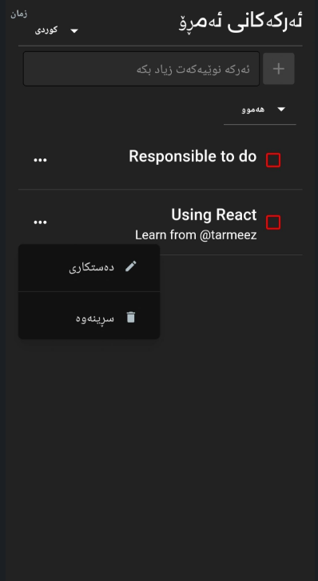

# To-Do List (React.js)

A simple and interactive **To-Do List application** built with **React.js**.  
This project allows users to manage their daily tasks easily by adding, completing, and deleting tasks.  

👉 [Live Demo](https://to-do-list-by-react-pi.vercel.app/)

---

## 📸 Preview
<!-- Add a screenshot here -->


---

## ✨ Features
- ➕ Add new tasks  
- ✅ Mark tasks as complete  
- ❌ Delete tasks  
- 📱 Responsive and clean UI  
- ⚡ Built with **React hooks & components**  

---

## 🛠️ Tech Stack
- **React.js**
- **JavaScript (ES6+)**
- **CSS / Styled Components**  
- **Node.js & npm**  

---

## 🚀 Getting Started

### 1. Clone the repository
```bash
git clone https://github.com/shahidfalah/To-Do-List-By-React.git
cd To-Do-List-By-React
